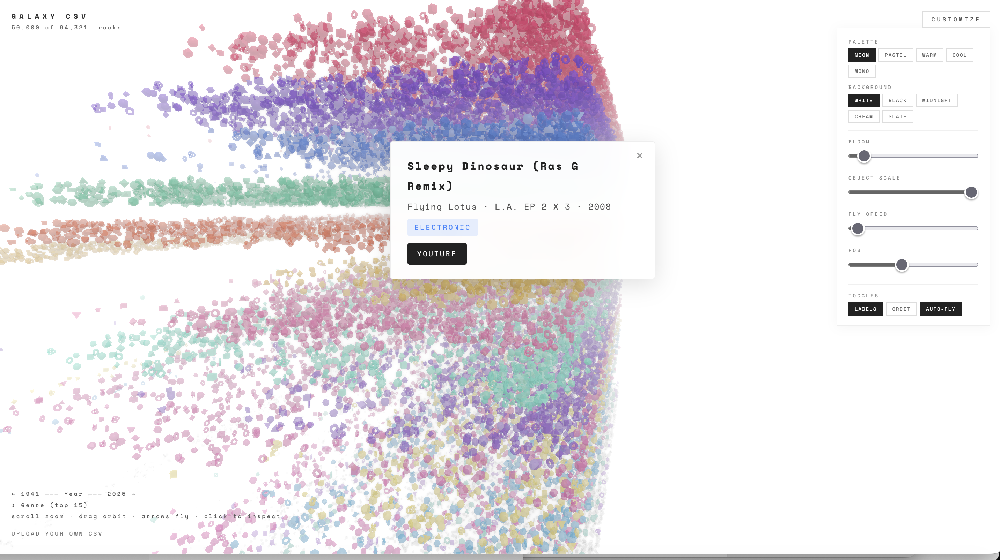

# Galaxy CSV

A 3D data visualizer that turns any CSV into a navigable galaxy of floating geometric shapes. Built with Three.js — no dependencies, no build step, just one HTML file.

**[Live Demo](https://markus-learning.github.io/galaxy-csv/)**



 

## What It Does

Drop a CSV file onto the page and watch it scatter into 3D space. Columns are auto-detected and mapped to axes:

- **X axis** — Year (or first numeric column)
- **Y axis** — Genre / category (bucketed, top 15 + Other)
- **Z axis** — Depth scatter for fly-through

Each category gets a unique color and shape. Click any object to see its details and jump to YouTube.

## Features

- **Auto-fly camera** drifts through the data field
- **Album card** — click any point to see song/artist/album + YouTube link
- **5 color palettes** — Neon, Pastel, Warm, Cool, Mono
- **5 backgrounds** — White, Black, Midnight, Cream, Slate
- **Adjustable bloom, scale, fog, fly speed**
- **Orbit mode** for hands-free rotation
- **Keyboard navigation** — Arrow keys / WASD
- **Drag-and-drop CSV upload** — works with any CSV
- **50K point limit** with automatic sampling for large files
- **Instanced rendering** — performs well even at high point counts

## Controls

| Input | Action |
|-------|--------|
| Click | Inspect point (album card) |
| Drag | Orbit camera |
| Scroll | Zoom |
| Arrow keys / WASD | Fly through scene |
| Customize button | Open settings panel |

## CSV Format

Any CSV works. The app auto-detects columns by name:

| Column | Detected keywords |
|--------|-------------------|
| Name | `name`, `title`, `song`, `track` |
| Artist | `artist`, `band` |
| Album | `album`, `release` |
| Genre | `genre`, `type`, `category`, `style` |
| Year | `year` |
| Duration | `time`, `duration`, `length` |

If columns aren't found, data is spread by row index. The included `music_library.csv` has ~64K tracks with columns: `Song, Artist, Album, Genre, Year, Duration`.

## Run Locally

```bash
git clone https://github.com/MARKUS-LEARNING/galaxy-csv.git
cd galaxy-csv
python3 -m http.server 8000
# open http://localhost:8000
```

Any static file server works — the app is a single `index.html` that loads Three.js from CDN.

## Stack

- [Three.js](https://threejs.org/) r162 (ES module via CDN)
- EffectComposer + UnrealBloomPass for glow
- OrbitControls for camera
- Instanced meshes (8 geometry types) for performance
- Zero build tools — pure HTML/JS

## License

MIT
